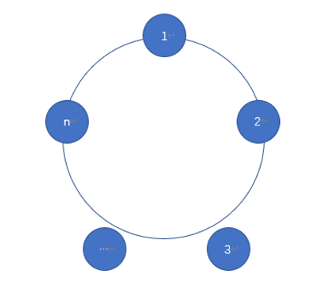
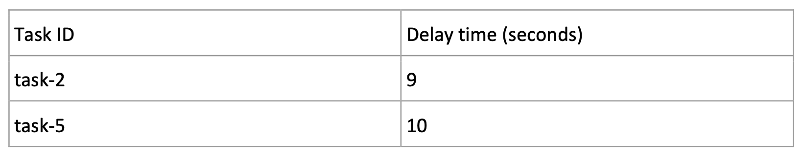
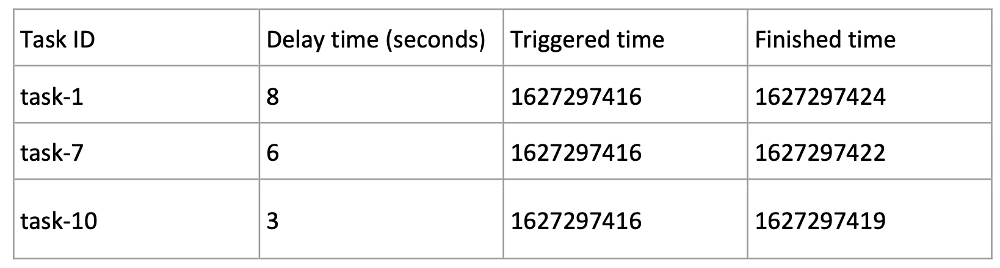
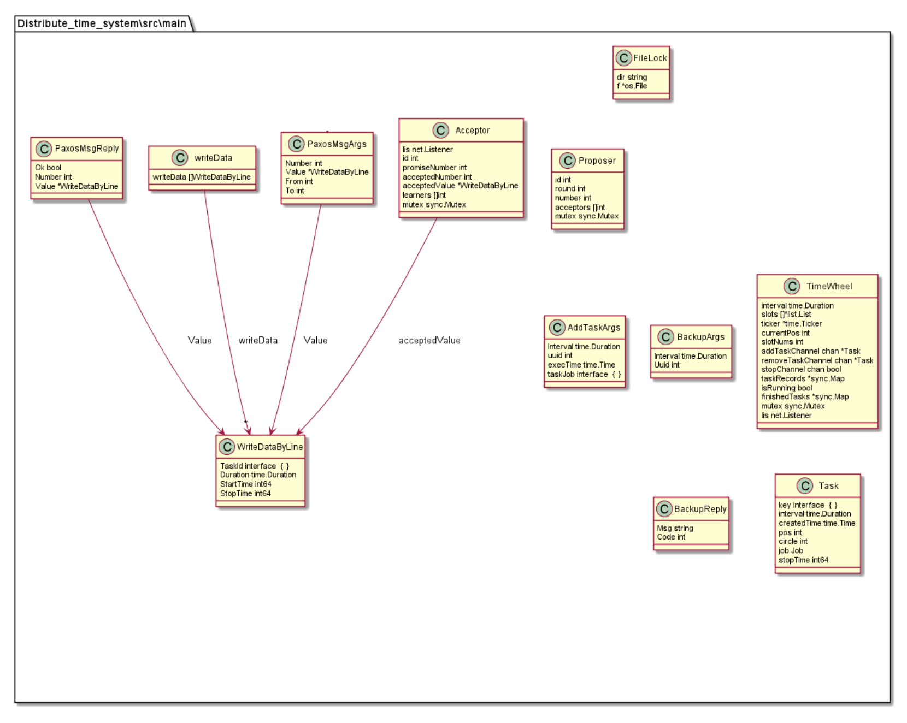
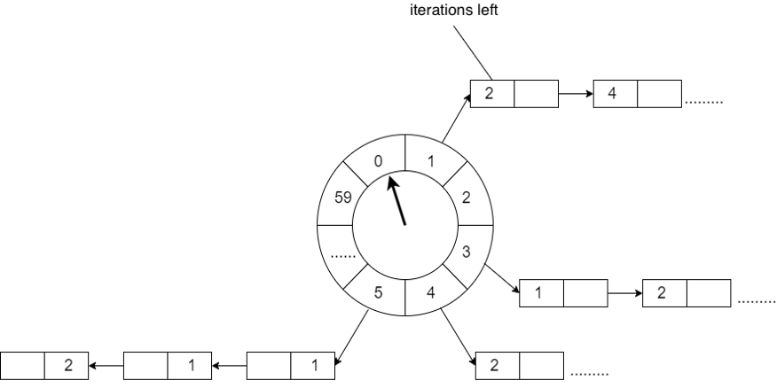
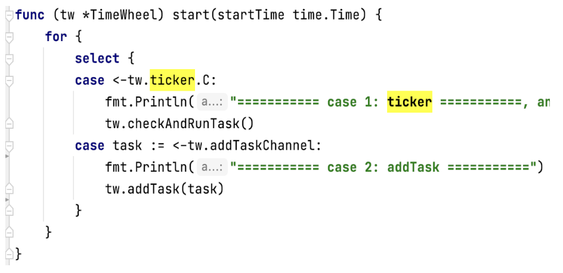
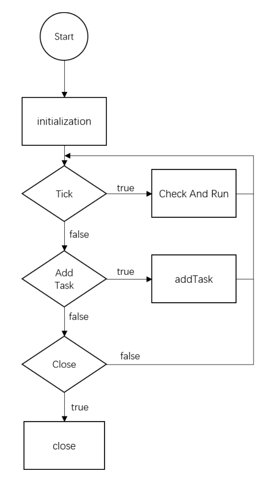
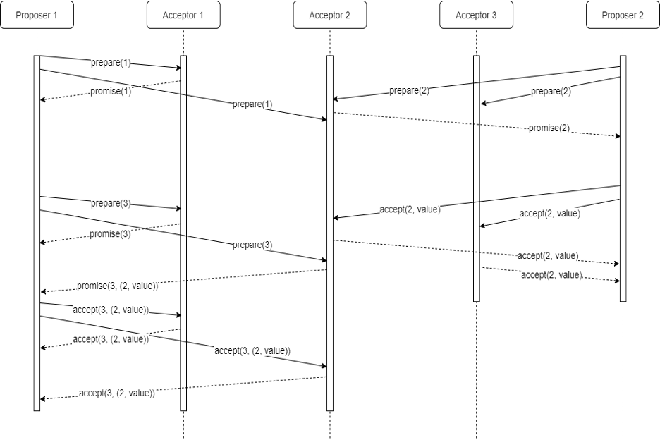

# Distributed Timer Service
* Xiao Liang 		s4569475
* Jinyang Huang 	s47355611

## Abstract

Timer in the Internet business has a very rich application scenarios, such as latency requirements (an order without a payment after half an hour will timeout, or the game lasts for 30 seconds), session timeout requirements, timing requirements (game release alert), email. One thing that they all have in common is the delay of trigger an event. For some broad and massive business requirements, it makes sense to implement a common and reliable timer service.

As such, we designed and implemented a simplified timing system, which is an extensible distributed service, and its general architecture is shown in the figure below.

The system ensure that each node can receive timing task input and keep each input task properly. Any task received by any node will be triggered on time.

## Functionality
### Input
Each machine read the .csv file, and each machine has no repeated tasks.

### Output
Each machine can decides the triggered time and triggered sequence itself. 

### Architecture
We have three oracle cloud instances, and we put distinct input `.csv` file in each machine. Each machine read the input line by line, as each line is a task. After reading each line, the machine put the task into **timeWheel** (section 2.1) and send the task by GRPC to the other two machines. When executing the tasks, each machine must decide whether the task has been executed (this is achieved by making a map data structure to store the task ID of executed tasks. Therefore, we can ensure that each task is executed once. 

After executing the task locally, each machine will store the finished task as output format into the other two machines’ log through the **Paxos** (section 2.2) consistency algorithm. 

If one machine is crushed, the machine will read the output of other machine to the local map data structure. 

The sequence of executing is as follows:

The code structure is as follows:

### Timewheel

Timewheel stores a circular queue, and it is implemented with array. Each element in the array stores a timed task queue. Timed task queue is a bi-directional circular queue. Each element in the chart is a timed task that is encapsulated with a task data structure. Each time slot represents the span of time. The total number of time slots is fixed, and the number is represented by wheelSize. Therefore, the final time interval can be calculated by totalSlotNumber * numberCircles + currentPosition. 

This is a screenshot how the timewheel starts:

This is the flow chart of the execution of timewheel:

### Paxos

Paxos is an algorithm to solve the problem of data consistency. There are three roles in the algorithm. That is, proposers, acceptors, and learning. In the real implementation, one process can take more than one role. Those roles can communicate by sending messages. 

The functions of the three roles are as follows:

Proposer: get the request and coordinate. It proposes the second phase for the request it gets from the customer.

Acceptor: vote and store data. It votes the proposed value that the get and make agree with the proposed value. Finally, they store the accepted value.

Learner: store value, but it does not involve with the vote. It only stores the accepted value.

In our algorithm, we deleted the learner. Each machine is proposer and acceptor the same time since each machine needs to both execute the task and store the output.

## Scope
MVP:
* One proposer only for a reduced paxos model.
* At least a built-in task will be regist and executed correctly.

## Quality Attributes
The key of our project is to ensure the correctness of regist and run tasks in a distributed enivronment and reasonably fast.
* Availability and Reliability
    * When a task is registed, it will be replicated in majority machines by paxos. So that every registed task will be executed becaue tasks are will replicated. Unless over have of the nodes in the cluster failed.
    * Nodes in cluster are able to reach a consensus by apply paxos. More specifically, when a task is executed, it could executed by any node,and after the execution the node will log execution record by paxos. Also before execute any task, a node will check the log first to see if the task is already executed. By this we ensure a task will be execute only once in a distributed enivronment. 
    * If somehow a node failed, after reboot (or rejoin the cluster), it will read the log to rebuild the timewheel to catch up other nodes.
    * Tasks will execute on time, no early or delay.
    * The system will have reasonable performance.

* Scalability
    * Nodes are free to join and leave the cluster, no need for shutdown and restart the whole service

## Trade-Offs
Since we used Paxos algorithm, it takes time to send messages through RPC because network latency. Therefore, for three machines, it is much slower than just one machine. However, Paxos ensures the consistency between different machines. Here, tradeoff is reliability and availability. This is an issue that we can do some improvement in the future. 

## Evaluation

### Availability and Reliability

To test our project, we firstly tested the program on our own laptop. 

We regist all tasks from a single node, So the cluster will have only one proposer. In this reduced situation, all tasks are correctly registed and executed. For the performance concern, it takes 232ms to finish 10 thousand tasks.

When single machine success, we tested the code on three oracle cloud instance with CentOS. We open three terminal and setup rpc connection to start the program. 

We setup different csv files on different machines so that every nodes will propose.
For three machines, it takes 16 minutes to finish 10 thousand tasks. All tasks are executed and all logs have the same output. Therefore, our program is successed.

### Scalability
Randomly set new node or beboot exist node or shutdown exist node and see if the service still running correctly.

## Critique
Initially, we were trying to build a distributed job scheduler that can regist any arbitrary task in any arbitrary form, a binary executable or a script.
Our project is well designed. Our result shows that all triggered tasks will execute on time, and all machines have the same output.

However, as we mentioned in the trade-offs section, there is network latency. The paxos algorithm uses so many rpc calls to ensure the consistancy. That is, acceptor will distribute tasks and send the log output to the other machines. There might be some effiect ways to avoid the huge amount of rpc. It is worth to further investigate.

## Reflection
Come up with an architecture of the whole system design is a hard process. We discussed a lot, and many solutions did not work very well. One important thing is that the algorithm of Paxos just make consistence on one single task. Also, in our design, we make each machine both proposer and acceptor. Therefore, we add some feature on the algorithm. To be specific, we increment the proposed ID after each propose to make sure that the do not conflict on the propose. 

What is more, we used go routine. Things always get complicated when it comes to multi thread (go routine). We printed out a lot of log messages to check where it went wrong. It is really thrilling when we found our project finally worked.

Lastly, teamwork is important. It will ease every one’s job when people collaborate. We separate our jobs by divide the project into two major parts. One is Paxos, the other is Timewheel. We implemented the code separately, and we integrated our code afterward. 
