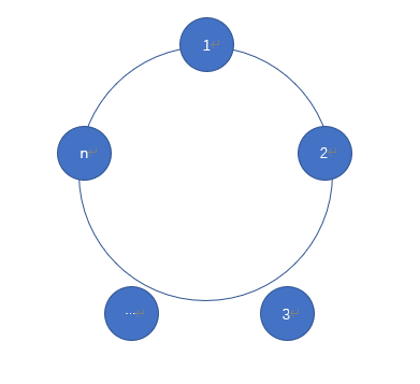
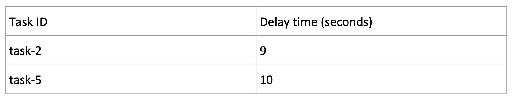
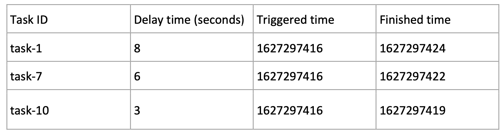
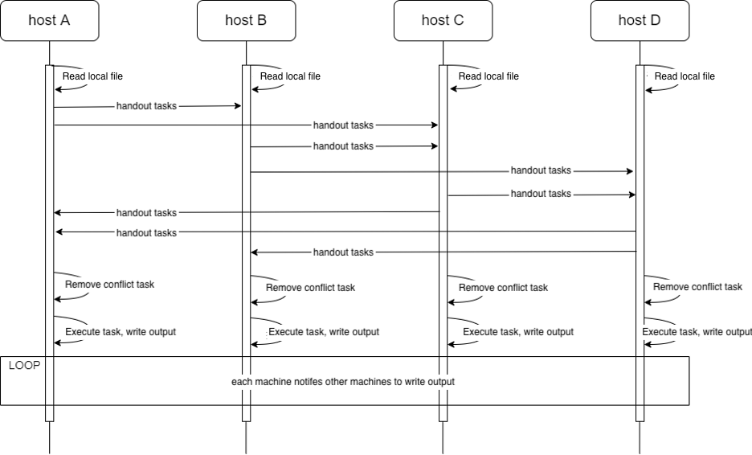
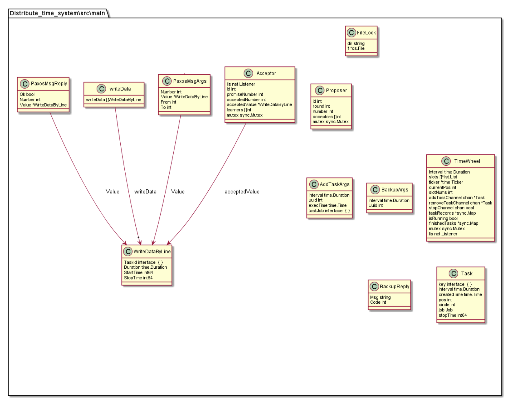
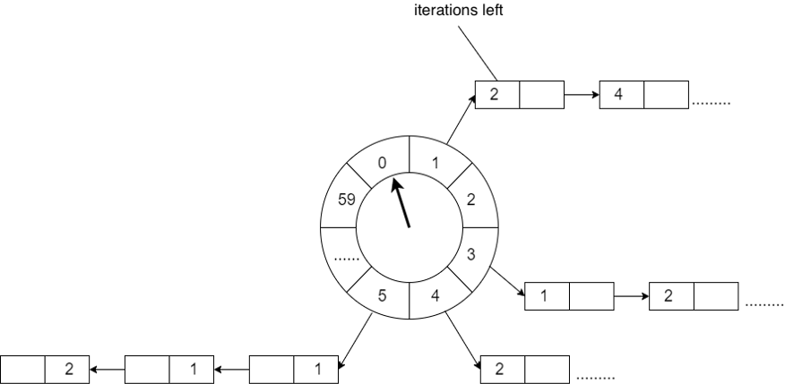
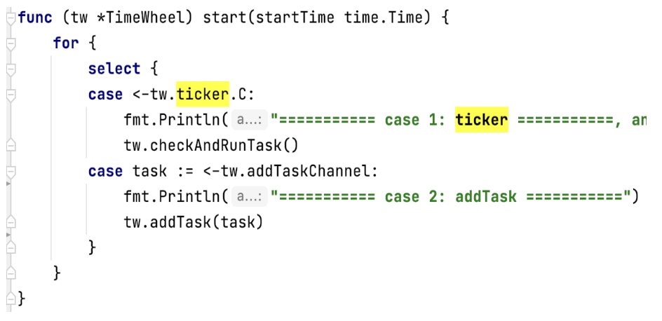
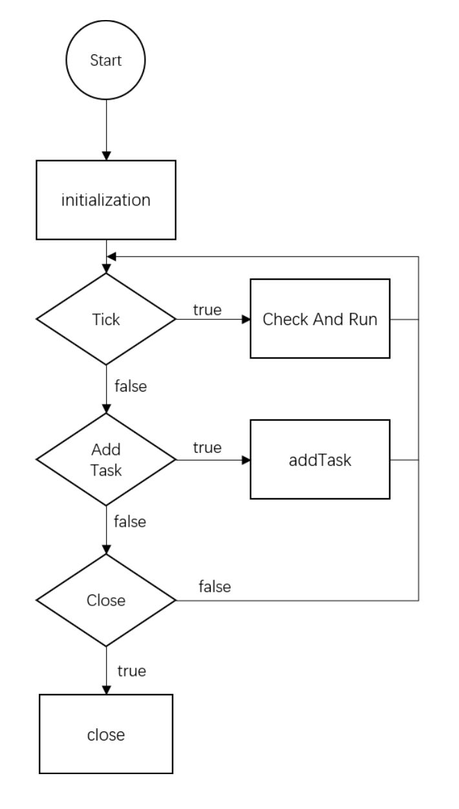
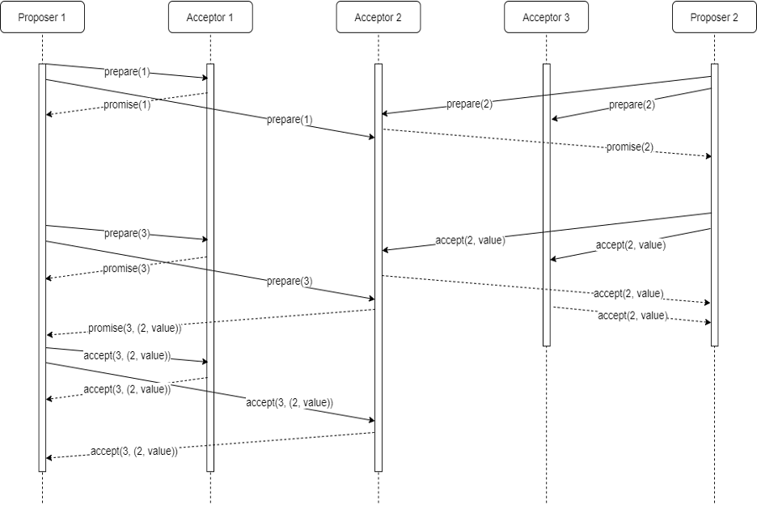

# Distributed Timer Service
* Xiao Liang 		s4569475
* Jinyang Huang 	s47355611

## 1 Abstract

Timer in the Internet business has a very rich application scenarios, such as latency requirements (an order without a payment after half an hour will timeout, or the game lasts for 30 seconds), session timeout requirements, timing requirements (game release alert), email. One thing that they all have in common is the delay of trigger an event. For some broad and massive business requirements, it makes sense to implement a common and reliable timer service.

As such, we designed and implemented a simplified timing system, which is an extensible distributed service, and its general architecture is shown in the figure below.

The system ensure that each node can receive timing task input and keep each input task properly. Any task received by any node will be triggered on time.

## 2 Functionality
### 2.1 Input
Each machine read the .csv file, and each machine has no repeated tasks.

### 2.2 Output
Each machine can decides the triggered time and triggered sequence itself. 

### 2.3 Architecture
We have three oracle cloud instances, and we put distinct input `.csv` file in each machine. Each machine read the input line by line, as each line is a task. After reading each line, the machine put the task into **timeWheel** (section 2.1) and send the task by GRPC to the other two machines. When executing the tasks, each machine must decide whether the task has been executed (this is achieved by making a map data structure to store the task ID of executed tasks. Therefore, we can ensure that each task is executed once. 

After executing the task locally, each machine will store the finished task as output format into the other two machines’ log through the **Paxos** (section 2.2) consistency algorithm. 

If one machine is crushed, the machine will read the output of other machine to the local map data structure. 

The sequence of executing is as follows:

The code structure is as follows:

### 2.4 Timewheel

Timewheel stores a circular queue, and it is implemented with array. Each element in the array stores a timed task queue. Timed task queue is a bi-directional circular queue. Each element in the chart is a timed task that is encapsulated with a task data structure. Each time slot represents the span of time. The total number of time slots is fixed, and the number is represented by wheelSize. Therefore, the final time interval can be calculated by totalSlotNumber * numberCircles + currentPosition. 

This is a screenshot how the timewheel starts:

This is the flow chart of the execution of timewheel:

### 2.5 Paxos

Paxos is an algorithm to solve the problem of data consistency. There are three roles in the algorithm. That is, proposers, acceptors, and learning. In the real implementation, one process can take more than one role. Those roles can communicate by sending messages. 

The functions of the three roles are as follows:

Proposer: get the request and coordinate. It proposes the second phase for the request it gets from the customer.

Acceptor: vote and store data. It votes the proposed value that the get and make agree with the proposed value. Finally, they store the accepted value.

Learner: store value, but it does not involve with the vote. It only stores the accepted value.

In our algorithm, we deleted the learner. Each machine is proposer and acceptor the same time since each machine needs to both execute the task and store the output.

## 3 Scope
Minimum viable product (MVP) will ensure some basic functionalities:
* One proposer only for a reduced paxos model. Even in this situation, the system will still be able to replicate tasks correctly.
* At least a built-in task will be regist and executed correctly. Ideally our system should be able to regist any kind of tasks, but we need at least one built-in task to ensure the correntness of timewheel implementation.

## 4 Quality Attributes
The key of our project is to ensure the correctness of regist and run tasks in a distributed enivronment and reasonably fast.
* Availability and Reliability
    * When a task is registed, it will be replicated in majority machines by paxos. So that every registed task will be executed becaue tasks are will replicated. Unless over have of the nodes in the cluster failed.
    * Nodes in cluster are able to reach a consensus by apply paxos. More specifically, when a task is executed, it could executed by any node,and after the execution the node will log execution record by paxos. Also before execute any task, a node will check the log first to see if the task is already executed. By this we ensure a task will be execute only once in a distributed enivronment. 
    * If somehow a node failed, after reboot (or rejoin the cluster), it will read the log to rebuild the timewheel to catch up other nodes.
    * Tasks will execute on time, no early or delay.
    * The system will have reasonable performance.

* Scalability
    * Nodes are free to join and leave the cluster, no need for shutdown and restart the whole service

## Trade-Offs
Since we used Paxos algorithm, it takes time to send messages through RPC because network latency. Therefore, for three machines, it is much slower than just one machine. However, Paxos ensures the consistency between different machines. Here, tradeoff is reliability and availability. This is an issue that we can do some improvement in the future. 

Another trade-off is we sacrificed flexibility and scalability of our system to ensure the availability and keep our system simple.
Normally, a distributed cluster is able to change it's configuration dynamically (on-the-fly) without temporarily shutdown the service. This feature would bring more reliability and scalability to the System.
However the complexity of this feature is huge. It is unrealistic to assume all the nodes would switch to the new configuration at same time. That is during the configuration change, it is inevitably some nodes are running with new configuration and others are still in the old mode. This will lead to split-brain problem, made our system unusable.

One more trade-off is we decided to not implement learner role in paxos. In paxos, learner is a role that don't have ability to propose but only accept proposal from others. We designed our system to be able to regist and execute task from any node, so learner role is not a must need in our system. Since there are only two of us developing, we'll make it easy by cut off unnecessary entities. This will made our abstruction of paxos less realistic, made our system less fixable to all kinds of situations

## Evaluation
Our test roughly separated into two parts: paxos and timewheel. Our priority objective is to ensure the functionality of our system is implemented correctly. Functionality is the capability of the software to provide functions which meet stated and implied needs when the software is used under specified conditions. It also has to be reliable, which means  our system can maintain some level of performance when used under specified conditions. Efficiency is also important to our system, we hope our system able to handle a large number of requests and maintain low usage of computational resources.

For testing methodology, we performed our test in a white-box way. Our test is based on internal functions, methods, inside modules, inter-module, inter-subsystem, inter-system, structure. 

### Timewheel
We firstly tested the program on our own laptop. We simulate 5 nodes under same machine to ensure a robust network environment. We setup to regist all tasks using only one node. By doing this, we minimize the interaction between timewheel and paxos, it allow us to focus on test if timewheel is implemented correctly. 

We use a csv file with list of tuples to represent ``{countdownTime, job}``. We verified the execution log to see if tasks were registed. We also compare the registration time and the execution time of each task to verify if tasks were actually executed after ``countdownTime`` times. In this situation all tasks are correctly registed and executed at a right time. For the performance concern, we measured the registration time, it takes 232ms to regist 10 thousand tasks. However, again, this is a single machine simulation, the number does not worth to take as a reference. 

### Paxos
In order to test paxos under a real network environment, we rent some virtual machines on Oracle Cloud. We setup three oracle cloud instance with CentOS.
First we regist all tasks from a single node, So the cluster will have only one proposer. In this reduced situation, all tasks are correctly replicated, registed and executed. 

When single proposer scenario success, We setup multiple different csv files for each machine so that every nodes will propose.
For three machines, it takes 16 minutes to finish 10 thousand tasks. All tasks are executed and all logs have the same output. Therefore, our program is able to work correctly under normal circumstances.

Next we test if paxos fail-over and redo log would work. We shutdown and reboot a running node to see what happens. Turns out, the service is still running, so the single failure will not effect whole service. After reboot, re-established the connection to other nodes and end up with same output compare to others. We believe this indicate that log catch-up is done correctly.

## Critique
Initially, we were trying to build a distributed job scheduler that can regist any arbitrary task in any arbitrary form, a binary executable or a script. But it is hard to make a good abstraction of it. Instead we used a built-in task to verify our paxos and timewheel part. This part in our project is considered well designed. Our result shows that all triggered tasks will execute on time, and all machines have the same output.

However, as we mentioned in the trade-offs section, there is network latency. The paxos algorithm uses so many rpc calls to ensure the consistancy. That is, acceptor will distribute tasks and send the log output to the other machines. There might be some effiect ways to avoid the huge amount of rpc. It is worth to further investigate.

## Reflection
Come up with an architecture of the whole system design is a hard process. We discussed a lot, and many solutions did not work very well. One important thing is that the algorithm of Paxos just make consistence on one single task. Also, in our design, we make each machine both proposer and acceptor. Therefore, we add some feature on the algorithm. To be specific, we increment the proposed ID after each propose to make sure that the do not conflict on the propose. 

What is more, we used go routine. Things always get complicated when it comes to multi thread (go routine). We printed out a lot of log messages to check where it went wrong. It is really thrilling when we found our project finally worked.

Lastly, teamwork is important. It will ease every one’s job when people collaborate. We separate our jobs by divide the project into two major parts. One is Paxos, the other is Timewheel. We implemented the code separately, and we integrated our code afterward. 
